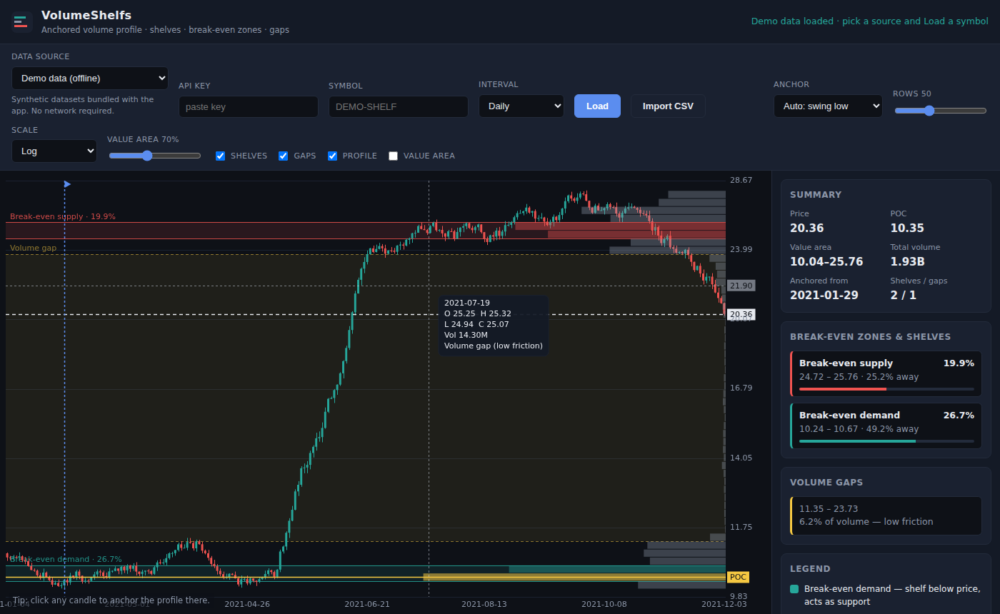
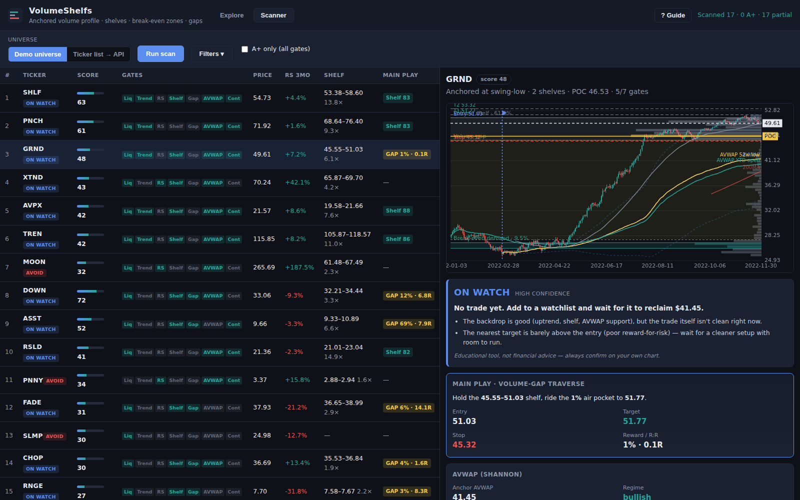

# VolumeShelfs

An anchored **volume-profile** analysis app. It reads volume as a function of
*price* (not time) and automatically surfaces the structures a discretionary
trader looks for:

- **Volume shelves** — contiguous clusters of high-volume price rows.
- **Break-even demand** — a shelf *below* price; tends to act as support
  (buyers who are back to break-even stop selling, so supply dries up).
- **Break-even supply** — a shelf *above* price; tends to act as resistance
  (holders who clawed back to break-even sell to get out).
- **Volume gaps** — thin "vacuum" zones with little traded volume, where price
  can move quickly because there is little friction.
- **POC** (point of control) and the **value area**.

The **main play** is the **volume-gap traverse**: a low-volume gap (LVN "air
pocket") bracketed by two shelves (HVN). Price holds the lower shelf, then
travels fast through the gap to the far shelf. On top of the volume profile sits
an **Anchored VWAP** layer (Brian Shannon, *Maximum Trading Gains with the
Anchored VWAP*): the AVWAP is the break-even cost basis since a significant
anchor, and *price above a rising AVWAP* + an **AVWAP reclaim**, **confluence
(pinch)** and **std-dev bands** confirm the play.

You anchor the profile from a swing low or swing high (or click any candle), and
the engine recomputes the shelves, gaps and break-even zones live.

The app has two tabs:

- **Explore** — load one symbol and study its anchored volume profile.
- **Scanner** — run the full *Volume Shelf Scanner* checklist across a universe
  of tickers, rank the candidates, and drill into each one's chart, gates,
  trade plan and confirmation checklist.




## Quick start

```bash
npm install
npm run dev      # http://localhost:5173
```

The app opens on bundled **offline demo data** so nothing is blank. Pick a data
source, enter a symbol and press **Load**.

```bash
npm run build    # type-check + production bundle into dist/
npm run preview  # serve the production build
npm test         # run the engine + parser unit tests (Vitest)
```

## Data sources

VolumeShelfs ships a small registry of providers (`src/data/`). The provider
dropdown, the API-key field and CSV import are all driven by it.

| Provider          | Key needed | Notes                                              |
| ----------------- | ---------- | -------------------------------------------------- |
| Demo data         | no         | Synthetic datasets bundled with the app (offline). |
| Alpha Vantage     | yes (free) | Daily/weekly/monthly equities, CORS-friendly.      |
| Twelve Data       | yes (free) | Stocks/ETF/FX/crypto, CORS-friendly.               |
| Stooq             | no         | Keyless CSV; may be CORS-blocked in some browsers. |
| CSV import        | —          | Drag in an OHLCV export from TradingView / broker. |

API keys are stored only in your browser's `localStorage`, never sent anywhere
except the provider you choose.

### Wiring in your own API

Implement the `DataProvider` interface and add it to the registry:

```ts
// src/data/providers/myApi.ts
import type { DataProvider } from "../types";
import { normalizeCandles } from "../types";

export const myApi: DataProvider = {
  id: "myapi",
  label: "My API",
  requiresApiKey: true,
  async fetchCandles(req, apiKey) {
    const res = await fetch(`https://example.com/ohlcv?symbol=${req.symbol}&key=${apiKey}`);
    const rows = await res.json();
    return normalizeCandles(
      rows.map((r) => ({
        time: r.t, open: r.o, high: r.h, low: r.l, close: r.c, volume: r.v,
      })),
    );
  },
};
```

```ts
// src/data/index.ts
export const PROVIDERS: DataProvider[] = [sampleProvider, myApi, /* ... */];
```

`fetchCandles` returns `Candle[]` with `time` in **epoch seconds**. Candles can
be in any order — `normalizeCandles` sorts them and drops bad rows.

## How it works

```
src/
  core/                 # pure, DOM-free, unit-tested analysis engine
    volumeProfile.ts    #   anchored profile: binning, POC, value area
    shelves.ts          #   shelf / gap detection + break-even classification
    swings.ts           #   swing-pivot detection for auto-anchoring
    indicators.ts       #   SMA, ATR, anchored VWAP, returns, slope
    avwap.ts            #   AVWAP anchors (52w hi/lo, YTD, earnings) + pinch
    avwapStrategy.ts    #   Shannon layer: state, reclaim/loss, std-dev bands
    gapPlay.ts          #   the main play: volume-gap traverse detection
    relativeStrength.ts #   RS vs a benchmark + RS line
    anchor.ts           #   significant-pivot anchor election (high or low)
    scanner.ts          #   universe scan: gates, factors, scoring, ranking
    tradePlan.ts        #   entry / stop / target levels (gap-play driven)
  data/                 # pluggable data providers, CSV parser, demo universe
  chart/                # canvas renderer (candles, profile, AVWAP/MA overlays)
  scanner-ui.ts         # scanner tab: table, detail, trade plan, checklist
  main.ts               # app controller + tab wiring
```

### The engine

`computeAnchoredProfile(candles, anchorIndex, params)`:

1. Take the price range (lowest low → highest high) over the anchored window.
2. Split it into `rowCount` rows — equally spaced in **log** or **linear**
   price space.
3. Spread each candle's volume across the rows its high-low range overlaps,
   weighted by overlap (a wide bar is not dumped into a single bucket).
4. The heaviest row is the **POC**; the **value area** grows out from it toward
   the heavier neighbour until it covers the chosen fraction of volume.

`analyzeProfile(profile, currentPrice, params)` then:

- marks rows ≥ `shelfThreshold` × POC volume and merges adjacent ones into
  **shelves**, classifying each as break-even demand / supply / at-price
  relative to the current price;
- marks interior rows ≤ `gapThreshold` × POC volume as **volume gaps**.

All thresholds, the row count, the scale and the value-area fraction are
adjustable live in the UI.

## The scanner

The **Scanner** tab implements the Volume Shelf Scanner checklist (a repeatable
shelf + anchored-VWAP-pinch setup). It runs a universe through a stack of
computable filters, scores and ranks the survivors, then lets you confirm each
by eye.

### Universe

- **Demo universe (offline)** — ~16 bundled synthetic tickers plus a benchmark
  with a mix of leaders, laggards, extended and illiquid names. Runs instantly,
  no key.
- **Ticker list → API** — paste a watchlist and a benchmark (default `SPY`); the
  scanner fetches each ticker's daily bars through the selected provider and
  scans them. Daily bars are the documented approximation; intraday only sharpens
  true volume-at-price.

### Anchor election (significant pivot, high *or* low)

The scanner doesn't just anchor from the swing low. For each ticker it builds a
candidate set — {earnings, major swing-low, major swing-high, 52-week high,
52-week low} — anchors a profile from each, and **elects the one whose fattest
shelf sits at current price** (the anchor that best "explains" where price
trades). A leader basing near its highs keeps its major-swing-**low** anchor; a
name that fell off a pivot **high** into a volume shelf (the ASST reference
case) flips to the **high** anchor. It falls back to the conservative swing-low
logic when no candidate has a qualifying shelf at price, and a `significance`
term (range position, move size, recency, with a reclaim discount) breaks ties.

### Gates (computed per ticker)

| Gate | Passes when |
| ---- | ----------- |
| **Liquidity** | price ≥ min, 20-day avg dollar volume ≥ min |
| **Trend & MA** | above a flat-to-rising 200-day MA, and above/within X% of the 50-day MA |
| **Relative strength** | outperforms the benchmark over 1mo **and** 3mo, with the RS line near highs or above its own 50-day MA |
| **Volume shelf** | a fat shelf (HVN run, ≥ k×mean volume) sits at price (anchor-aware: at/below for a low anchor, the shelf price pulled into for a high anchor) |
| **Volume gap** (main play) | an *active* gap play — price at a support shelf with a low-volume air pocket above leading to a target shelf — with R:R ≥ min and air pocket ≥ min |
| **AVWAP** (Shannon) | price above a *rising* long-side AVWAP, or a fresh AVWAP reclaim (confluence/pinch shown alongside) |
| **Contraction** | ATR(14) contracting and no high-volume breakdown bar through the shelf in the last 5 bars |

### The main play — volume-gap traverse

A volume gap (LVN) bracketed by two shelves is an air pocket price travels
through quickly. `gapPlay.ts` pairs each gap with the support shelf below
(entry) and the target shelf above, and the trade plan rides it: **enter** on a
reclaim of the support-shelf top, **stop** just below the shelf, **target** the
far side of the gap. The Shannon AVWAP layer confirms it — you want price above
a rising AVWAP (or a reclaim) before committing; below the key AVWAP the plan
says *wait for the reclaim*.

### Ranking

Each candidate gets a 0–100 score. Six factors — **ideal shelf-at-price**,
**gap-play quality** (the two volume-profile factors carry the most weight),
relative strength, AVWAP constructiveness, pinch tightness, and range
contraction — are min-max normalized across the scanned set and combined with
adjustable weights. Candidates are ordered by **hard-gate count first**
(liquidity + trend + RS), so a clean downtrend with a fat decline shelf and a
tight gap can't outrank a real leader, then by score. Toggle **A+ only** to show
names that clear all seven gates.

### Plain-English verdict (for beginners)

Every candidate gets a one-word call so you don't have to read seven gates
yourself: **BUY / BUY THE DIP / WAIT FOR RECLAIM / ON WATCH / AVOID**, with a
one-line "why" and the exact entry / stop / target. The logic mirrors a
disciplined trader: don't fight liquidity, don't fight the trend, only buy
support when the AVWAP confirms and the reward-to-risk is worth it — otherwise
wait. It will not tell you to buy a wide-stop / low-reward trade, and most of
the time the honest answer is *wait*. (Educational tool, not financial advice.)

### Per-candidate detail

Click any row to load its chart with the support shelf, the AVWAP (key
break-even line) and its ±1σ bands, confluence AVWAPs, 50/200-day MAs, and the
trade-plan levels, plus:

- the **verdict panel** (the plain-English call above),
- the **main-play panel** (the gap traverse, or the shelf-at-price ideal),
- the **AVWAP panel** (regime, slope/side, reclaim/loss, pinch),
- the **gate breakdown**, a gap-play-aware **trade plan**, and the **manual
  confirmation checklist**.

### Chart controls & the Guide

- **Timeframe buttons** (1M / 3M / 6M / 1Y / All) set how much history is shown;
  the chart defaults to 6M so candles are legible instead of a squashed year.
  You can also **scroll to zoom**, **drag to pan**, and **double-click to reset**
  — the price axis auto-fits whatever is visible.
- The **Guide** (*? Guide* button, top-right) explains every jargon term
  (break-even supply/demand, POC, value area, AVWAP, gaps, gates, R:R, …) in
  plain English; badges and headings are click-to-define and jump to the entry.

### The Anchor Coach (Explore tab)

Instead of silently auto-picking, the Explore tab **coaches** you on where to
anchor: it finds the major swing low and swing high, marks them on the chart,
and tells you which to use *and why* — e.g. "price is holding above the $10 swing
low, anchor there to see support," or "price has pulled off the $28 high, anchor
there to see overhead supply." One click on **Swing low / Swing high** applies
it. The Explore tab also shows the same plain-English **verdict** for the loaded
symbol (relative strength is marked *unknown* there, since it has no benchmark).

> The bundled demo universe is synthetic, so gate passes vary. A pullback-from-a-
> high like the ASST archetype is correctly recognized as the *ideal shelf/anchor
> structure* (high anchor, fat shelf, active gap play) yet is **not** forced to
> A+: it trades below its AVWAPs and fails the trend/RS gates, so the plan flags
> it as a watch-for-reclaim setup rather than a buy-now leader. With live data
> the same engine runs unchanged.

## Tuning the controls

- **Rows** — more rows = finer price resolution (the video author favours ~50).
- **Scale** — use **log** for instruments with a large percentage range.
- **Value area** — fraction of volume defining the value area (70% standard;
  the video suggests 100% for a uniform look).
- **Anchor** — auto swing-low / auto swing-high / manual (click a candle).

## Disclaimer

This is an analysis and educational tool, not financial advice. Volume-profile
structure describes where trading has occurred; it does not predict the future.
